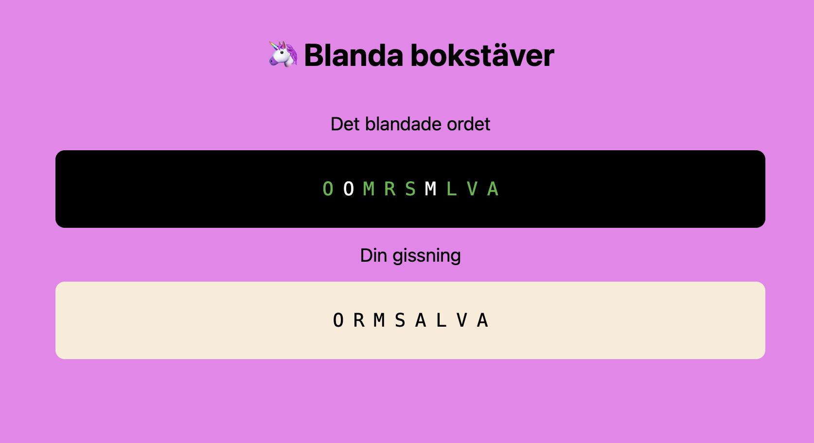

# Blanda bokstäver

Ett spel utvecklat tillsammans med min sexåring, som stått för spelidé och färgval.

Vi spelar spelet från en telefon där _Spelare 1_ skriver in ett ord, klickar på **Spela** och räcker därefter över telefonen till _Spelare 2_ som ska gissa ordet. När det rätta ordet är inskrivet är spelet slut och _Spelare 2_ kan fortsätta med att bestämma ett ord. Vi brukar ge någon ledtråd och använda bokstäver i det blandade ordet markeras i grönt, vilket kan vara till hjälp vid längre ord.

_Exempel där det korrekta ordet är SOMMARLOV_

Spelet finns på https://spel.sommerfeld.nu/
